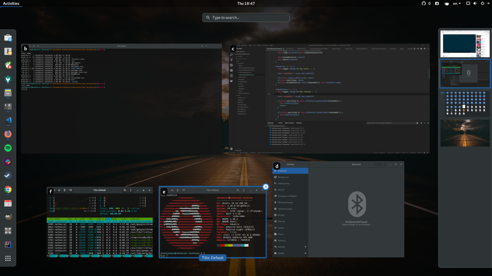
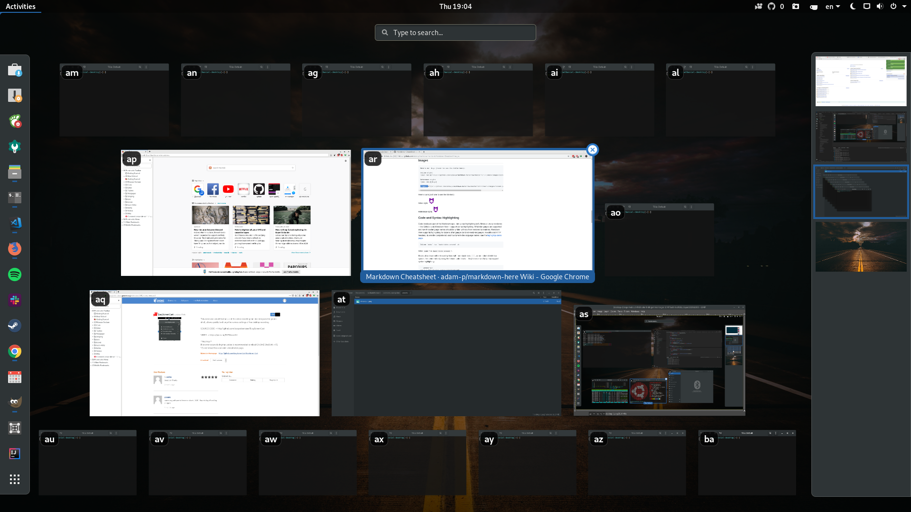

# Overview Navigation

This extension aims to make Gnome Shell easier to navigate using only the keyboard. It is inspired by the vim plugins of Firefox and Chrome.

## Usage

In the overview, the user can press `space` and letters are going to pop in the corner of every window. To focus a particular window, you have to press its letters one after the other.

### Example with few open windows

### Example with lots of open windows

A similar extension can be found [here](https://extensions.gnome.org/extension/10/windownavigator/)
